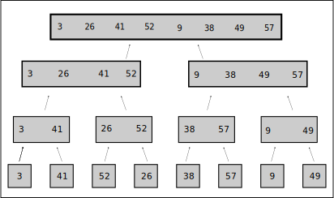

# Chapter 1 Introduction
## 1.1 Algorithms
### 1.1-1 
Using figure 1.2 as a model, illustrate the operation of `INSERTION-SORT` on the array A = (31, 41, 59, 26, 41, 58).

### 1.1-2 
Rewrite the `INSERTION-SORT` procedure to sort into nonincreasing instead of nondecreasing order.

This is a matter of changing the comparison logic from greater than to less than.

```
INSERTION-SORT(A)
 for j <- 2 to length[A]
  do key <- A[j]
    > Insert A[j] into the sorted sequence A[1..j-1].
    i <- j - 1
    while i > 0 and A[i] < key
     do A[i + 1] <- A[i]
      i <- i - 1
    A[i + 1] <- key
```
### 1.1-3
Consider the **searching problem**:

 **Input:** A sequence of n numbers A = (a<sub>1</sub>, a<sub>2</sub>,....a<sub>n</sub>) and a value _v_.
 
 **Output:** An index i such that _v_ = A[i] or tthe special value `NIL` if _v_ does not appear in A.
 
 Write pseudocode for **linear search**, which scans through the sequence, looking for _v_.

 This is a matter of iterating over the sequence and performing an equals comprison operation and returning NIL if no value was found.

 ```
 LINEAR-SEARCH(A, v)
  for i <- 1 to length[A}
   if A[i] = v
    return A[i]
  return NIL
 ```
### 1.1-4
Consider the problem of adding two n-bit binary integers, stored in two n-element arrays A and B. The sum of the two integers should be stored in binary form in an (n + 1)-element array C. State the problem formally and write pseudocode for adding the two integers.

That seems like an adequately formal statement of the problem. The solution is to iterate over the binary arrays A and B from least to greatest place and adjust bits in the current and next place in array C appropriately. Importantly, this involves calculating an intermediate value for the next place in array C when two bits have a value of 1 to account for base 2 carry during addition and account for a potential 1 value already in the C array from previous bit additions.
```
BINARY-ADDITION(A, B)
 C <- arrayOfLength[length[A]]
 for i <- 1 to length[A]
  if A[i] = 0 and B[i] = 0
   C[i] <- ADD-BINARY-DIGITS(C[i], 0)
  else if A[i] = 0 and B[i] = 1
   if C[i] = 1
    C[i + 1] <- ADD-BINARY-DIGITS( C[i + 1], 1)
   C[i] <- ADD-BINARY-DIGITS(C[i], 1)
  else if A[i] = 1 and B[i] = 1
   C[i + 1] <- ADD-BINARY-DIGITS( C[i + 1], 1)
   C[i] <- 0
 return C

ADD-BINARY-DIGITS(v1, v2)
 if v1 = 0 and v2 = 0
  return 0
 else if v1 = 1 and v2 = 1
  return 0
 else
  return 1
```
## 1.2 Analyzing algorithms
### 1.2-1
Consider sorting _n_ numbers stored in array A by first finding the smallest element of A and putting it in the first entry of another array B. Then find the second smallest element of A and put it in the second entry of B. Continue in this manner for the _n_ elements of A. Write pseduocode for the algorithm, which is known as selection sort. Give the best-case and worst-case running times of selection sort in Θ-notation.

The pseudocode below loops over array B and for each element in B loops over A to find the lowest remaining value in A. The values in A are replaced by NIL as they are copied to B. The worst case running time is Θ(n<sup>2</sup>).

```
SELECTION-SORT(A)
 B <- arrayOfLength[length[A]]
 for j <- 1 to length[B]
  for i <- 1 to length[A]
   if currentValue = NIL and A[i] != NIL
    currentValue <- A[i]
    currentIndex <- i
   else if currentValue > A[i]
    currentValue <- A[i]
    currentIndex <- i
  B[j] <- currentValue;
  A[currentIndex] <- NIL
```
### 1.2-2
Consider linear search again (see exercise 1.1-3). How many elements of the input sequence need to be checked on the average, assumming that the element being searched for is equally likely to be any element in the array? How about in the worst case? What are the average-case and worst-case running times of linear search in Θ-notation? Justify your answers.

Half of the elements will need to be compared on average with an equal distribution of searched for elements in the array. In the worst case, meaning the searched for element is the last one in the array, all elements will need to be compared. The average case scenario is Θ(n/2) and the worst case scenario is Θ(n).

### 1.2-3
Consider the problem of determining whether an arbitrary sequence (x<sub>1</sub>,x<sub>2</sub>,...,x<sub>n</sub>) of _n_ numbers contains repeated occurrences of some number. Show that this can be done in Θ(_n_ lg _n_) time, wher lg _n_ stands for log<sub>2</sub> _n_.

A repeated occurance is finding the same value more than once. So starting with the first element, search through the rest of the sequence looking for that value. Repeat on the second element, but it is not necessary to compare to the previous element because those two elements have already been compared. So as we continue through the sequence there are fewer elements to compare to each time. The value log<sub>2</sub> _n_ represents the decreasing number of comparisons necessary in addition to each element of the sequence, hence Θ(_n_ lg _n_). 

### 1.2-4
Consider the problem of evaluating a polynomial at a point. Given _n_ coefficients a<sub>0</sub>, a<sub>1</sub>,...,a<sub>n-1</sub> and a real number _x_, we wish to compute $`\displaystyle\sum_{i=0}^{n-1} a_i x^i `$. Describe a straightforwaard Θ(n<sup>2</sup>)-time algorithm for this problem. Describe a Θ(n)-time algorithm that uses the following method (called [Horner's rule](https://infogalactic.com/info/Horner%27s_method)) for rewriting the polynomial:
$`\displaystyle\sum_{i=0}^{n-1} a_i x^i `$ = (...(a<sub>n-1</sub>x + a<sub>n-2</sub>)x + ... + a<sub>1</sub>)x + a<sub>0</sub>.

I believe the Θ(n<sup>2</sup>)-time solution is arrived at by considering the multiplications of x<sup>n</sup> as _n_ steps. So for the each value of _n_ we'll have _n_+1 multiplications (coefficent + number of _x_ multiplications), and we must multiply that again by _n_ for each a<sub><n/sub> coefficient to be processed.

Using Horner's method, we eliminate the multiplications of _x_ for each value of _i_ and instead multiply by _x_ at each new nested coefficient expression.

### 1.2-5
Express the function n<sup>3</sup>/1000 - 100n<sup>2</sup> - 100n + 3 in terms of Θ-notation.

This appears to be Θ(1) as greater values of _n_ do not cause greater numbers of operations to be performed.

### 1.2-6
How can we modify almost any algorithm to have a good best-case running time?

Detecting if the results are already in the desired end state can often be accomplished with a number of steps fewer or equal to the algorithm itself, allowing the execution to be skipped in best-case scenarios.
## 1.3 Designing algorithms
### 1.3-1
Using Figure 1.3 as a model, illustrate the operation of merge sort on the array A = (3, 41, 52, 26, 38, 57, 9, 49).


### 1.3-2
Write speudocode for `MERGE(A,p,q,r)`.

```
MERGE(A,p,q,r)
 i1 <- p
 i2 <- q
 while i1 < q or i2 < r
  if A[i2] < A[i1]
   SWAP(A[i2], A[i1[)
   i2 <- i2 + 1
  else
   i1 <- i1 + 1
```

### 1.3-3
Use mathematical induction to show that the solution of the recurrence

$` T(n) =
  \begin{cases}
    2       & \quad \text{if } n \text{ = 2}\\
    2T(n/2) + n  & \quad \text{if } n \text{ = }2^k, k > 1
  \end{cases}
`$

is T(n) = n lg n.

We have a strong hint of log<sub>2</sub>n performance due to the T(n/2) term.

$`T(n) = 2T(n/2) + n = 2T(2^k/2) + 2^k`$

$`T(n - 1) = 2T(n-1/2) + n-1`$

$`T(n - 2) = 2T(n-2/2) + n-2`$

T(n) = 2 log<sub>2</sub>n + n = n log<sub>2</sub>n

### 1.3-4 
Insertion sort can be expressed as a recursive procedure as follows. In order to sort A[1..n], we recurseively sort A[1..n-1] and then insert A[n] into the sorted array A[1..n-1]. Write a recurrence for the running time of this recursive version of insertion sort.

$` T(n) =
  \begin{cases}
    n       & \quad \text{if } n \text{ = 1}\\
    T(n^2) + 1  & \quad \text{if } n \text{ > 1} 
  \end{cases}
`$

### 1.3-5
Referring back to the searching problem (see Exercise 1.1-3), observe that if the sequence A is sorted, we can check the midpoint of the sequence against v and eliminate half of the sequence from further consideration. **Binary search** is an algorithm that repeats this procedure, halving the size of the remaining portion of the sequence each time. Write pseudocode, either iterative or recursive, for binary search. Argue that the worst-case running time of binary search is Θ(lg n).

```
BINARY-SEARCH(A, value)
 midpoint <- length[A] / 2
 for i <- 0; i < log<sub>2</sub> length[A] + 1, i <- i + 1
  if A[midpoint] = value
   return midpoint
  else if A[midpoint] < value
   midpoint <- midpoint / 2
  else if A[midpoint] > value
   midpoint <- midpoint + (midpoint / 2)
 return NIL
```
The worst case running time is Θ(log<sub>2</sub> n) because each iteration eliminate half the elements from the remain search space. In the case of eight elements, log<sub>2</sub> 8 = 3, in which three corresponds to the number of iterations needed to find the element or conclude that it doesn't exist.

### 1.3-6
Observe that the **while** loop of lines 5-7 of the `INSERTION-SORT` procedure in Section 1.1 uses a linear search to scan (backward) through the sorted subarray A[1..j-1]. Can we use a binary search (see Exercise 1.3-5) instead to improve the overall worst-case running time of insertion sort to Θ(n lg n)?

No, because that part of the algorithm is also shifting the elements in the array in order to insert the current key value into the correct location. So every element must be processed.

### 1.3-7
Describe a Θ(n lg n)-time algorithm that, given a set _S_ of _n_ real numbers and another real number _x_, determines whether or not there exist two elements in _S_ whose sum is exactly _x_.

As a first Θ(n log<sub>2</sub> n) step, perform merge sort to sort the set _S_. Then set two indeicies _i_ and _j_ respectively with the first and last alement of the sorted sequence. While i < j test to see if _S_[i] + _S_[j] is the desired sum. If not, increment i if the sum is too low or decrement j if the sum is too high. In the worst case scenarion, no two elements sum to the tested value, this will execute in Θ(n), which gives us a runtime of Θ(n log<sub>2</sub> n + n), which simplifies to Θ(log<sub>2</sub> n).
## 1.4 Summary
### 1.4-1
Suppose we are comparing implementations of insertion sort and merge sort on the same machine. For inputs of size n, insertion sort runs in 8n<sup>2</sup> steps, while merge sort runs in 64n log<sub>2</sub> _n_ steps. For which values of _n_ does insertion sort beat merge sort? How might one rewrite the merge sort pseudocode to make it even faster on small inputs?

### 1.4-2
What is the smallest value of _n_ such that an algorithm whose running time in 100_n_<sup2</sup> runs faster than an algorithm whose running time is 2<sup>n</sup> on the same machine?

## Problems
### 1-1 Comparisons of running times
For reach function f(n) and time t in the following table, determine the largest sinze _n_ of a problem that can be solved in time _t_, assumming that the algorithm to solve the problem take f(n) microseconds.

### 1-2 Insert sort on small arrays in merge sort
Although merge sort run in Θ(n lob<sub>2</sub> n) worst-case time and insertion sort runs in Θ(n<sup>2</sup>) worst-case time, the constant factors in insertion sort make it faster for small _n_. Thus, it makes sense to user insertion sort within merge sort when subproblems become sufficiently small. Consider a modification to merge sort in whcih _n_/_k_ sublists of length _k_ are sorted using insertions sort and then merged using the standard merging mechanism, where _k_ is a value to be determined.

**a.** Show that the _n_/_k_ sublists, each of length _k_, can be sorted by insertion sort in Θ(_nk_) worst-case time.

**b.** Show that the sublists can be merged in Θ(_n_ log<sub>2</sub> (_n_/_k_)) wost-case time.

**c.** Given that the modified algorithm runs in Θ(_nk_ + _n_ log<sub>2</sub> (_n_/_k_) worst-case time, what is the largest asymptotic (Θ-notiation) value of _k_ as a function of _n_ for which the modified algorithm has the same asymptotic running time as standard merge sort?

**d.** How should _k_ be chosen in practice?

### 1-3 Inversions
Let A[1..n]] be and array of _n_ distinct number. If i < j and A[i] > A[j], then the pair (i, j) is called an **_inversion_** of A.

**a.** List the five inverstions of the array (2, 3, 8, 6, 1).

**b.** What array with elements from the set {1, 2, ..., n} has the most inversions? How many does it have?

**c.** What is the relationship between the running time of insertion sort and the number of inversions in the input array? Justify your answer.

**d.** Give an algorithm that determines the number of inversions in any permutation of _n_ elements in Θ(_n_ log<sub>2</sub> _n_) worst-case time. (_Hint:_ Modify merge sort.)

