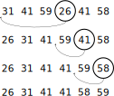

# Chapter 1 Introduction
## 1.1 Algorithms
### 1.1-1
Using figure 1.2 as a model, illustrate the operation of `INSERTION-SORT` on the array A = (31, 41, 59, 26, 41, 58).

### 1.1-2
Rewrite the `INSERTION-SORT` procedure to sort into nonincreasing instead of nondecreasing order.
`&larr;

```
`
```
